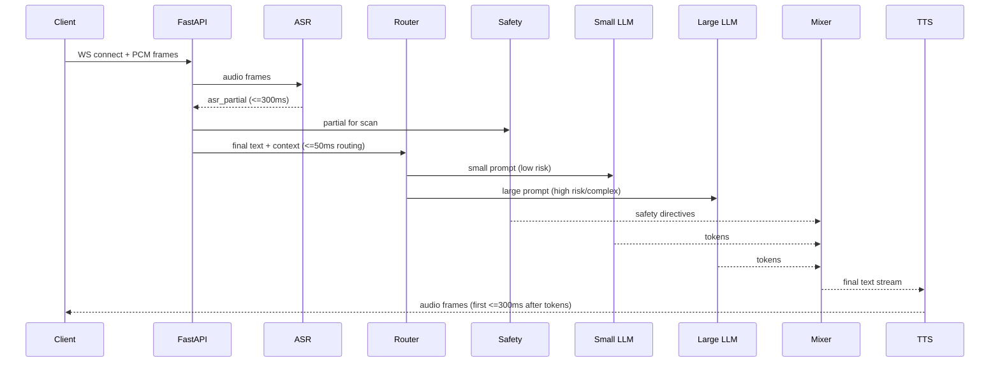

# Omani Therapist – Voice CBT Assistant (Omani Arabic)

[](#) [](#) [](#) [](#license)

Culturally-adapted, **safety-first** voice therapy companion for **Omani Arabic** with real-time ASR → LLM → TTS. Dual-model routing balances speed and depth; crisis protocols align to Oman’s emergency services (9999) with Arabic playbooks.

---

## Table of Contents
- [Features](#features)
- [Live Demo & Video](#live-demo--video)
- [Architecture](#architecture)
- [Tech Stack](#tech-stack)
- [Repository Structure](#repository-structure)
- [Quickstart (Local)](#quickstart-local)
- [Environment Variables](#environment-variables)
- [Running the Voice UI](#running-the-voice-ui)
- [API Reference](#api-reference)
- [Safety Protocols](#safety-protocols)
- [Cultural Adaptation (Oman)](#cultural-adaptation-oman)
- [Performance Benchmarks](#performance-benchmarks)
- [Evaluation (Dual-Model vs Single)](#evaluation-dualmodel-vs-single)
- [Deployment (Azure)](#deployment-azure)
- [Roadmap](#roadmap)
- [Contributing](#contributing)
- [Security & Privacy](#security--privacy)
- [License](#license)

---

## Features
- 🎙️ **Real-time voice**: streaming mic → partial ASR → streamed LLM → streamed TTS (Opus/WAV).
- 🧭 **Dual-model routing**: small model for low-risk quick turns, large model for complex/reflection/safety.
- 🛡️ **Safety engine**: Arabic/English detection (R0–R3), scripted Arabic escalation language, Oman resources.
- 🕌 **Cultural fit**: Omani-Arabic tone & phrases; respectful faith-aligned coping when user invites it.
- 📈 **Observability**: structured logs, OpenTelemetry traces, Azure Monitor dashboards & KQL.
- 🚀 **Cloud-native**: Azure Container Apps, ACR, Key Vault; blue/green revisions; autoscaling.

---

## Live Demo & Video
- 10-minute demo plan (architecture → 3 scenarios → safety escalation → metrics).  
  _See `docs/04_technical_docs.md` for the shot list and overlays._

---

## Architecture

### High-Level System

flowchart LR
  U[User (Web/Mobile)]-->|Opus/PCM WS| GW[FastAPI Gateway]
  GW -->|frames| ASR[ASR Service]
  ASR -->|partial/final text| RT[Policy Router]
  RT -->|scan| SAFE[Safety Engine]
  RT -->|low risk| S[Small LLM]
  RT -->|complex/risky| L[Large LLM]
  S --> MIX[Response Mixer]
  L --> MIX
  SAFE --> MIX
  MIX --> TTS[TTS Service]
  TTS -->|audio stream| U
  GW <-->|session| R[(Redis)]
  GW --> LOGS[(Structured Logs)]
  LOGS --> BLOB[(Blob Storage)]
```

### Voice Turn (Latency Budget)


> **Mermaid note:** GitHub renders Mermaid by default. If preview doesn’t load locally, use VS Code extension “Markdown Preview Mermaid Support”.

---

## Tech Stack
**Backend**
- FastAPI, Uvicorn, WebSocket streaming
- ASR: Faster-Whisper (Arabic tuned)
- LLMs: `llama3.2:3b-instruct` (small), `qwen2.5:7b-instruct` (large) via Ollama/VLLM
- TTS: Coqui / Piper (Arabic, 16kHz)
- Safety: keyword + transformer classifier + rules
- State: Redis (sessions/rate limiting), Azure Blob (artifacts)

**Frontend**
- React/Next.js (or Vite React)
- MediaRecorder/WebAudio (push-to-talk), live captions, risk badges

**Infra / DevOps**
- Azure Container Apps, Azure Container Registry, Key Vault, Monitor/Log Analytics
- GitHub Actions (CI/CD), Blue/Green revisions, autoscale (WS/CPU)

---

## Repository Structure
```
omani-therapist/
├─ apps/
│  ├─ web/                 # React/Next voice UI
│  └─ api/                 # FastAPI gateway + services
├─ models/                 # model configs, router policy, prompts
├─ safety/                 # crisis rules, keywords, unit tests
├─ eval/                   # eval data & scripts (WER, PRF, human ratings)
├─ docs/                   # architecture, deployment, safety, culture, etc.
├─ scripts/                # bench_lat.py, k6 ws/ http scripts, seeders
├─ infra/                  # IaC (Bicep/Terraform) & env manifests
├─ .github/workflows/      # ci.yml (build/push/deploy)
└─ README.md
```

---

## Quickstart (Local)
```bash
git clone https://github.com/<you>/omani-therapist.git
cd omani-therapist
python -m venv .venv && source .venv/bin/activate
pip install -r apps/api/requirements.txt

uvicorn apps.api.main:app --host 0.0.0.0 --port 8000 --reload

cd apps/web && npm i && npm run dev
```

---

## Environment Variables
| Key | Example | Notes |
|---|---|---|
| `ASR_MODEL` | `whisper-small-ar` | Faster-Whisper variant |
| `LLM_SMALL_HOST` | `http://localhost:11434/llama3.2:3b-instruct` | small route |
| `LLM_LARGE_HOST` | `http://localhost:11434/qwen2.5:7b-instruct` | large route |
| `SAFETY_CFG_URL` | `blob://…/safety.yaml` | keywords/rules/thresholds |
| `REDIS_URL` | `redis://localhost:6379/0` | sessions/limits |
| `JWT_PUBLIC_KEY` | `-----BEGIN PUBLIC KEY-----…` | auth |
| `ALLOWED_ORIGINS` | `https://app.example.com` | CORS |

> In production, store secrets in **Azure Key Vault** and reference from Container Apps.

---

## Running the Voice UI
- Open the Web UI → **Hold to talk** → see partial captions, model route (Small/Large), risk badge (R0–R3), and streamed audio reply.
- Export session logs (redacted) for QA from the UI **Session Menu**.

---

## API Reference

### WebSocket `/v1/audio/stream`
**Auth:** `Authorization: Bearer <JWT>`

**Client → Server**
```jsonc
{ "type": "start", "sample_rate": 16000, "lang": "ar-OM" }
{ "type": "audio", "format": "pcm16", "payload_b64": "..." }
{ "type": "stop" }
```

**Server → Client**
```jsonc
{ "type":"asr_partial","text":"هلا...","is_final":false }
{ "type":"asr_final","text":"هلا تعبان من الشغل","start":1.2,"end":2.8 }
{ "type":"route","model":"small","risk_tier":"R1" }
{ "type":"safety","tier":"R2","action":"inject_resources" }
{ "type":"audio","codec":"opus","payload_b64":"..." }
{ "type":"turn_end","lat_ms":1840,"tokens":128 }
```

### REST `/v1/tts`
`POST { "text": "...", "voice": "omani_female_a" }` → WAV bytes

---

## Safety Protocols
- **Risk tiers**: R0 neutral, R1 distress, R2 ideation (no plan), R3 imminent risk.  
- **Actions**: empathy & grounding → safety planning (C-SSRS/SPI) → R3 escalation (stay engaged, ask location, encourage 9999).  
- **Non-negotiables**: no instructions for self-harm; no secrecy if life risk is present; clear consent & boundaries.  
- **Oman resources**: **Royal Oman Police 9999**, **MOH/Al Masarra Hospital** contacts.  
Detailed document: `docs/07_safety_protocols.md` (+ Word/PDF in `/releases`).

---

## Cultural Adaptation (Oman)
- **Tone**: gentle, respectful; Omani dialect with MSA for formalities.
- **Lexicon**: greetings, validations, softeners (*لو حاب*, *أفهم شعورك*), faith-aligned coping when user invites it.
- **UX**: RTL captions, bilingual toggle, respectful defaults for address.
Full guide (with web sources used): `docs/06_cultural_adaptation.md` (+ Word/PDF).

---

## Performance Benchmarks
**Latency metrics (per turn)**: `t_asr_partial`, `t_route`, `t_llm_ft`, `t_tts_ft`, `t_e2e` (p50/p90/p99).  
**Accuracy**: ASR **WER** on ar-OM set; Safety **P/R/F1** for R2/R3; LLM human ratings.  
**Scale**: concurrent WS sessions, throughput, autoscale behavior.

Run:
```bash
python scripts/bench_lat.py --host wss://api.example.com/v1/audio/stream --dir samples/

k6 run -e HOST=wss://api.example.com/v1/audio/stream -u 100 -d 10m scripts/load_k6_ws.js
```
Azure Monitor (KQL) snippet is in `docs/08_performance_benchmarks.md`.

---

## Evaluation (Dual-Model vs Single)
- Datasets: TherapyEval-OM (Omani Arabic), RiskEval (R0–R3).
- Metrics: helpfulness (Likert), empathy rubric, **R2/R3 recall**, latency p50/p90.
- Reproduce:
```bash
poetry run python eval/run_eval.py --config eval/config.dual.yaml
```

---

## Deployment (Azure)
- **Container Apps** per microservice (api, asr, router, safety, llm_small, llm_large, tts).
- **Revisions** for blue/green + canary traffic; rollback instantly.
- **CI/CD** with GitHub Actions → ACR build → ACA deploy.

CLI:
```bash
az acr build -r $ACR -t omani-therapist/api:$(git rev-parse --short HEAD) -f apps/api/Dockerfile .

az containerapp update -n $APP -g $RG \
  --image $ACR.azurecr.io/omani-therapist/api:$(git rev-parse --short HEAD)
```

Ingress/TLS/WAF, scaling, and troubleshooting are detailed in `docs/02_deployment.md`.

---

## Roadmap
- **0–1 mo**: stabilize, dashboards, incident runbooks  
- **1–3 mo**: **Memory** (Redis short-term, Postgres long-term, pgvector), eval automation  
- **3–6 mo**: mobile edge ASR, adaptive routing, operator console  
- **6–12 mo**: therapist hub, analytics lakehouse, governance  
- **12–24 mo**: on-device models, multimodal cues, GCC localization  
See `docs/10_roadmap.md` (+ Word/PDF).

---

## Contributing
1. Fork & branch from `main`.  
2. `pre-commit install` (ruff, black, isort, mypy).  
3. PRs must pass CI and include tests for safety changes.  
See `CONTRIBUTING.md`.

---

## Security & Privacy
- Short-lived JWT; per-session caps (duration/turns/tokens).  
- Redaction in logs; audio not stored by default; transcripts opt-in only.  
- Escalation audit trail; access reviews; incident response playbook.

---

## License
MIT — see [LICENSE](./LICENSE).

---

### Acknowledgments
Thanks to open-source communities around **FastAPI**, **Whisper/Faster-Whisper**, **Coqui/Piper**, and the wider Arabic NLP ecosystem.
